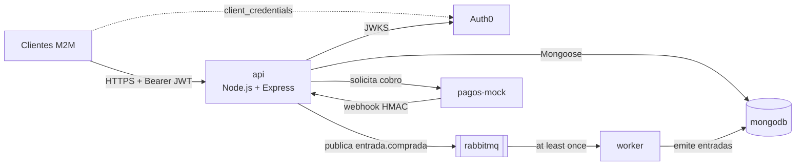

# TPI IAEW 2026 — Eventos y Entradas

Trabajo Práctico Integrador de la cátedra **Integración de Aplicaciones en Entornos Web** (UTN FRC, 2026).

> **Estado: Entrega 1 (diseño y esqueleto) — 05/10/2026.** Incluye diagramas C4, ADRs, el contrato OpenAPI 3.1, el modelo de datos con migraciones y seed, y un Docker Compose que levanta todos los contenedores. La lógica de negocio se implementa en la Entrega 2 (16/11/2026): mientras tanto, cada operación del contrato responde `501 NOT_IMPLEMENTED`. Los puntos marcados **(Entrega 2)** describen cómo se va a usar el sistema terminado.

Consigna: https://utn-frc-iaew.github.io/iaew-2026-ecommerce-api/tpi/index.html

## 1. Proyecto, dominio e integrantes

| Integrante | Legajo |
|---|---|
| Juan Cruz Ceballos | 94239 |
| Santino Magris | 91999 |
| Mateo Estrada Uriz | 95556 |

**Dominio 6 — Eventos y entradas:** publicar eventos, vender entradas y validar el ingreso.

## 2. Problema y alcance

Un organizador publica eventos con capacidad limitada. Un canal de venta compra entradas en nombre de los asistentes y el control de acceso las valida en la puerta. Hay que evitar la **sobreventa**, las **compras duplicadas** por reintentos, los **pagos rechazados** que retienen cupo y el **reingreso** con una entrada ya usada.

| Requisito de la consigna | Cómo se cubre |
|---|---|
| CRUD de 2 entidades | **Eventos** (CRUD completo) y **Compras** (crear = reservar, leer, actualizar = pagar y eliminar = cancelar, como baja lógica; [ADR 0001](docs/adr/adr-0001-estilo-api-rest.md)) |
| Transacción multi-paso | Reservar cupo → pagar (pasarela simulada) → confirmar por webhook → emitir entradas |
| OAuth 2.0 + JWT con scopes | Auth0 `client_credentials` con `read:eventos`, `write:eventos`, `admin:eventos`, `buy:entradas` y `validate:entradas` |
| Endpoint con `x-api-key` | `GET /internal/reportes/ventas` |
| Productor → broker → consumidor | `api` publica `entrada.comprada` en RabbitMQ (patrón outbox) y `worker` emite las entradas |
| Integración adicional | **Webhook de pago** firmado con HMAC-SHA256 (`POST /webhooks/pagos`) |
| Errores del dominio | `EVENT_SOLD_OUT`, `PAYMENT_REJECTED` (compra `rechazada`), `TICKET_ALREADY_USED`, `IDEMPOTENCY_KEY_MISMATCH` |

## 3. Arquitectura en un vistazo



| Documento | Contenido |
|---|---|
| [docs/c4-context.md](docs/c4-context.md) | C4 nivel 1: actores y sistemas externos |
| [docs/c4-container.md](docs/c4-container.md) | C4 nivel 2: contenedores (coinciden con `docker-compose.yml`, salvo la tarea de arranque `db-init`) |
| [docs/c4-component.md](docs/c4-component.md) | C4 nivel 3: componentes de `api` + secuencia del flujo de compra |
| [docs/openapi.json](docs/openapi.json) | Contrato OpenAPI 3.1 (también en http://localhost:3000/api-docs) |
| [docs/modelo-datos.md](docs/modelo-datos.md) | Colecciones, índices, máquinas de estado, migraciones y seed |
| [docs/eventos/](docs/eventos/README.md) | Contrato de `entrada.comprada` y topología de RabbitMQ |
| [docs/adr/](docs/adr/README.md) | Decisiones de arquitectura |

## 4. Requisitos previos

- Docker Desktop (Docker Engine 24 o posterior, con Compose v2).
- Node.js 22 o posterior y npm (solo para desarrollo local y tests; el sistema corre completo en Docker).
- Una cuenta gratuita de Auth0, para probar los endpoints protegidos.
- curl o Postman.

## 5. Variables de entorno

```bash
cp .env.example .env
```

| Variable | Uso | Valor local por defecto |
|---|---|---|
| `PORT` | Puerto de la API | `3000` |
| `MONGODB_URI` | Conexión a MongoDB (en Compose se reemplaza por `mongodb:27017`) | `mongodb://127.0.0.1:27017/iaew_eventos` |
| `AUTH0_DOMAIN` | Tenant de Auth0 (issuer `https://<dominio>/`) | `tu-tenant.us.auth0.com` |
| `AUTH0_AUDIENCE` | Identifier de la API en Auth0 | `https://iaew-eventos-api` |
| `AUTH0_CLIENT_ID` / `AUTH0_CLIENT_SECRET` | Cliente M2M, solo para pedir tokens; la API no las usa | vacío |
| `INTERNAL_API_KEY` | Clave del endpoint `/internal` | `colocar-api-key-local` |
| `RABBIT_URL`, `RABBIT_USER`, `RABBIT_PASS` | RabbitMQ | `iaew` / `iaew-local` |
| `RETRY_DELAY_MS`, `MAX_RETRIES` | Reintentos del worker | `3000`, `3` |
| `OUTBOX_INTERVALO_MS` | Cada cuánto el relay del outbox publica los eventos pendientes | `1000` |
| `PAGOS_URL`, `WEBHOOK_URL` | Pasarela simulada y URL del webhook | `http://localhost:4000`, `http://localhost:3000/webhooks/pagos` |
| `WEBHOOK_SECRET`, `WEBHOOK_TOLERANCIA_SEGUNDOS` | Secreto HMAC compartido y ventana anti-replay | `colocar-secreto-compartido-local`, `300` |
| `RESERVA_TTL_MINUTOS` | Vencimiento de una reserva sin pagar | `15` |
| `PAGO_TIMEOUT_MINUTOS` | Cuánto espera un pago pendiente antes de que el barrido lo concilie con la pasarela | `30` |
| `BARRIDO_INTERVALO_MS` | Cada cuánto corre el barrido del worker (vencimientos, conciliación de pagos, cupo) | `60000` |
| `EVENTO_FINALIZA_TRAS_HORAS` | Horas después de la fecha del evento en que pasa a `finalizado` | `12` |

`.env` está en `.gitignore`. **Nunca se commitean valores reales.**

## 6. Configuración de Auth0

1. **Applications → APIs → Create API:** Name `IAEW Eventos API`, Identifier `https://iaew-eventos-api` (es el `AUTH0_AUDIENCE`), Signing Algorithm `RS256`.
2. En la API, en la pestaña **Permissions**, agregar los scopes `read:eventos`, `write:eventos`, `admin:eventos`, `buy:entradas` y `validate:entradas`.
3. Crear una aplicación **Machine to Machine** por rol (*Applications → Create Application*). Al crear la API, Auth0 genera sola una "IAEW Eventos API (Test Application)", que se puede renombrar y usar como la primera.
4. En cada aplicación, ir a la pestaña **API Access**, elegir `IAEW Eventos API` y, en la pestaña **Client Access**, otorgar solo los scopes del rol. *User-Delegated Access* no se usa y debe quedar en 0.

   | Aplicación M2M | Scopes (Client Access) |
   |---|---|
   | `iaew-organizador` | `read:eventos`, `write:eventos`, `admin:eventos` |
   | `iaew-canal-venta` | `read:eventos`, `buy:entradas` |
   | `iaew-control-acceso` | `validate:entradas` |

5. **Expiración del token:** en *APIs → IAEW Eventos API → Settings*, poner **Token Expiration (Seconds)** en `3600` (por defecto es `86400`). La API valida `exp` y rechaza un token vencido con 401 `TOKEN_INVALID` ([ADR 0004](docs/adr/adr-0004-seguridad-auth0-scopes.md)).
6. Copiar el **Domain** de la aplicación (por ejemplo `dev-xxxx.us.auth0.com`, sin `https://`) a `AUTH0_DOMAIN`, y su Client ID y Client Secret a `AUTH0_CLIENT_ID` y `AUTH0_CLIENT_SECRET` en `.env`. Después, recrear la API para que tome los valores: `docker compose up -d api`.

## 7. Obtener un token (`client_credentials`)

```bash
set -a; . ./.env; set +a
TOKEN=$(curl -s --request POST "https://$AUTH0_DOMAIN/oauth/token" \
  --header 'content-type: application/json' \
  --data "{\"client_id\":\"$AUTH0_CLIENT_ID\",\"client_secret\":\"$AUTH0_CLIENT_SECRET\",\"audience\":\"$AUTH0_AUDIENCE\",\"grant_type\":\"client_credentials\"}" \
  | node -pe 'JSON.parse(require("fs").readFileSync(0)).access_token')
```

## 8. Probar endpoints protegidos con Bearer

Esto ya funciona en la Entrega 1: `/token-info` muestra `iss`, `aud`, `sub`, los scopes y la vigencia del token (`issuedAt`, `expiresAt`, `expiresInSeconds`).

```bash
curl -s http://localhost:3000/token-info -H "Authorization: Bearer $TOKEN"
curl -i http://localhost:3000/token-info                          # 401 TOKEN_INVALID
```

Para ver la expiración en acción: bajar *Token Expiration* a `60`, pedir un token, esperar más de un minuto y repetir la llamada. Responde 401 `TOKEN_INVALID`; con un token nuevo vuelve a 200. Restaurar `3600` después. Los clientes deben reutilizar el token hasta que se acerque a `expiresAt` y no pedir uno por request.

**(Entrega 2)** Con el scope correcto, `GET /eventos` responde 200. Sin el scope responde 403 `SCOPE_REQUIRED`.

## 9. Probar el endpoint con `x-api-key`

**(Entrega 2)**

```bash
curl -s http://localhost:3000/internal/reportes/ventas -H "x-api-key: $INTERNAL_API_KEY"   # 200
curl -i http://localhost:3000/internal/reportes/ventas                                     # 401 API_KEY_INVALID
```

## 10. Levantar el sistema

```bash
cp .env.example .env            # opcional: Compose tiene valores por defecto locales
docker compose up -d --build
docker compose ps               # mongodb y rabbitmq healthy, db-init "exited (0)", api healthy
```

| Servicio | URL |
|---|---|
| API (health) | http://localhost:3000/health |
| Swagger UI | http://localhost:3000/api-docs |
| Contrato JSON | http://localhost:3000/api-docs/openapi.json |
| RabbitMQ management | http://localhost:15672 (`iaew` / `iaew-local`) |
| Pasarela simulada | http://localhost:4000/health |

**Desarrollo sin contenerizar la API** (con `mongodb` y `rabbitmq` en Docker):

```bash
docker compose up -d mongodb rabbitmq
npm ci
npm run migrate && npm run seed
npm run dev          # API con recarga
npm run worker       # en otra terminal
```

Detener: `docker compose down`. Borrar también los datos: `docker compose down -v`.

> Si ya habías levantado una versión anterior del repo, corré `docker compose down` antes de `up`: RabbitMQ no usa volumen y conservaría la cola de retry vieja, con argumentos distintos a los actuales.

## 11. Datos iniciales

El job `db-init` corre `npm run migrate` (índices con migrate-mongo) y `npm run seed` (3 eventos de demostración, con fechas a 45, 52 y 65 días de la primera ejecución para que sigan vendiendo) antes de que arranque la API. Ambos son idempotentes. Detalle en [docs/modelo-datos.md](docs/modelo-datos.md#estrategia-de-migraciones-y-seed).

| Evento | Id | Para probar |
|---|---|---|
| Recital de Rock Sinfónico | `66f000000000000000000001` | Flujo feliz (500 lugares) |
| Charla íntima de Jazz | `66f000000000000000000002` | `EVENT_SOLD_OUT` (2 lugares) |
| Obra de teatro (en preparación) | `66f000000000000000000003` | `EVENT_NOT_PUBLISHED` (borrador) |

Para ver el estado de las migraciones: `npm run migrate:status`.

## 12. Ejecutar las pruebas

```bash
npm test               # node --test: smoke de la API, RabbitMQ, outbox, config y token; coherencia del contrato, el evento, el compose, el C4, los índices de las migraciones y los enlaces de la documentación
npm run check          # sintaxis de los puntos de entrada
npm run lint:openapi   # valida docs/openapi.json con Redocly (reglas en redocly.yaml)
docker compose config --quiet
```

**(Entrega 2)** Se suman tests de integración del flujo, la colección de Postman con ambientes en `postman/` (ejecutable con Newman) y una prueba de carga con reporte.

## 13. Flujo asincrónico: cómo dispararlo y dónde ver el efecto

**Entrega 1:** al arrancar, el `worker` declara la topología. En http://localhost:15672 → *Queues* aparecen `emision.entrada-comprada`, `.retry` y `.dlq`, y en *Exchanges* aparecen `entradas.exchange`, `entradas.retry.exchange` y `entradas.dlx`.

El relay del outbox ya funciona. Para verlo sin el webhook, se puede insertar a mano una compra `pagada` con su evento pendiente:

```bash
docker compose exec -T mongodb mongosh iaew_eventos --quiet --eval '
const id = ObjectId();
db.compras.insertOne({ _id: id, estado: "pagada", idempotencyKey: "demo-outbox-" + id,
  emisionEvento: { eventId: crypto.randomUUID(), type: "entrada.comprada", version: 1,
    occurredAt: new Date().toISOString(), correlationId: "demo", data: { compraId: id.toString() } } })'
docker compose logs api | grep Outbox     # "Outbox: 1 evento(s) entrada.comprada publicados"
```

El mensaje queda en la cola `emision.entrada-comprada`, que se puede ver en la consola de RabbitMQ. Si RabbitMQ está detenido, la compra queda pendiente y se publica sola cuando el broker vuelve.

**(Entrega 2):**

1. Crear una compra (`POST /compras`) y pagarla con `POST /compras/{id}/pagar` y `{"escenario":"aprobado"}`.
2. La pasarela llama al webhook. La compra pasa a `pagada` y registra el evento en el outbox, y en menos de un segundo el relay de la API publica `entrada.comprada`.
3. El worker emite las entradas. El efecto se ve en `GET /compras/{id}/entradas`, que pasa de `[]` a N entradas, y en `emisionEstado: emitida`. En la consola de RabbitMQ se ve el mensaje, y en los logs del worker su `eventId` y `correlationId`.

Contrato y topología: [docs/eventos/README.md](docs/eventos/README.md).

## 14. Probar la integración elegida (webhook de pago)

**(Entrega 2)** `pagos-mock` firma cada notificación con `X-Pago-Firma: sha256=HMAC(WEBHOOK_SECRET, "<timestamp>.<cuerpo>")` y `X-Pago-Timestamp`. Escenarios:

- `{"escenario":"aprobado"}`: la compra queda `pagada` y se emiten las entradas.
- `{"escenario":"rechazado"}`: la compra queda `rechazada` y se libera el cupo (`GET /eventos/{id}`).
- Firma alterada o timestamp viejo: 401 `WEBHOOK_SIGNATURE_INVALID` / `WEBHOOK_TIMESTAMP_EXPIRED`.
- Notificación repetida: 200 con `duplicado: true`, sin efectos dobles.
- Webhook que nunca llega: al vencer `pagoExpiraEn` (`PAGO_TIMEOUT_MINUTOS`), el barrido del worker consulta `GET /pagos?compraId=` a la pasarela y resuelve la compra (`pagada`, `rechazada` o `expirada`). Para provocarlo, apagar `pagos-mock` después de `/pagar` y bajar `PAGO_TIMEOUT_MINUTOS` y `BARRIDO_INTERVALO_MS`.
- Pasarela caída al pagar: `/pagar` responde 503 y la compra queda en `pago_pendiente`. Reintentar con la misma `Idempotency-Key` vuelve a enviar el cobro.

Diseño: [ADR 0006](docs/adr/adr-0006-webhook-pago-hmac.md).

## 15. Observar el sistema

**Entrega 1:** `docker compose logs -f api worker` y la consola de RabbitMQ.

**(Entrega 2)** Diseño propuesto en el [ADR 0008](docs/adr/adr-0008-observabilidad-correlation-id.md):

- Logs JSON con pino, con `correlationId` en cada línea.
- Header `X-Correlation-Id`, que se propaga a la pasarela, al webhook y al evento.
- `GET /metrics` con prom-client.
- Prometheus + Grafana con p95, throughput y error rate.

## 16. Endpoints principales

| Método y ruta | Scope / credencial | Descripción |
|---|---|---|
| `GET /health` | pública | Estado del servicio |
| `GET /token-info` | Bearer (cualquier scope) | Diagnóstico del token |
| `GET /eventos`, `GET /eventos/{id}` | `read:eventos` | Listar y obtener eventos |
| `POST /eventos`, `PATCH /eventos/{id}` | `write:eventos` | Crear, modificar y publicar eventos |
| `POST /eventos/{id}/cancelar` | `write:eventos` | Cancelar un evento: corta ventas y anula entradas |
| `DELETE /eventos/{id}` | `admin:eventos` | Eliminar un evento sin ventas |
| `POST /compras` | `buy:entradas` + `Idempotency-Key` | Paso 1: reservar cupo |
| `POST /compras/{id}/pagar` | `buy:entradas` + `Idempotency-Key` | Paso 2: solicitar el pago (202) |
| `POST /webhooks/pagos` | firma HMAC | Paso 3: resultado del pago |
| `GET /compras/{id}/entradas` | `buy:entradas` | Paso 4: entradas emitidas |
| `GET /compras`, `GET /compras/{id}`, `POST /compras/{id}/cancelar` | `buy:entradas` | Consultar y cancelar **las compras propias** (`creadaPor` = `sub` del token; una compra ajena responde 404) |
| `GET /entradas/{codigo}`, `POST /entradas/{codigo}/validar` | `validate:entradas` | Control de acceso. `validar` recibe `{ "eventoId": "…" }` (el evento de la puerta) |
| `GET /internal/reportes/ventas` | `x-api-key` | Reporte de ventas |

Ejemplo **(Entrega 2)** del paso 1, con sus ejemplos completos de respuesta en el contrato:

```bash
curl -s -X POST http://localhost:3000/compras \
  -H "Authorization: Bearer $TOKEN" -H 'Content-Type: application/json' \
  -H 'Idempotency-Key: compra:ana-40123456:recital:0001' \
  -d '{"eventoId":"66f000000000000000000001","cantidad":2,"asistente":{"nombre":"Ana Pérez","email":"ana.perez@example.com","documento":"40123456"}}'
```

Los errores siempre tienen el formato `{ "error", "code", "retryable", "action", "details"? }` ([ADR 0001](docs/adr/adr-0001-estilo-api-rest.md)).

## 17. Decisiones técnicas

Stack: **Node.js 22 + Express 4 (CommonJS), MongoDB 7 + Mongoose 8, RabbitMQ 4.2 + amqplib, Auth0 + express-oauth2-jwt-bearer**.

| ADR | Decisión |
|---|---|
| [0001](docs/adr/adr-0001-estilo-api-rest.md) | Estilo REST, acciones como sub-recurso, sin `/v1`, errores uniformes |
| [0002](docs/adr/adr-0002-rest-vs-grpc.md) | REST/JSON y no gRPC |
| [0003](docs/adr/adr-0003-mongodb-migraciones-seed.md) | MongoDB, migrate-mongo y seed idempotente |
| [0004](docs/adr/adr-0004-seguridad-auth0-scopes.md) | Auth0, scopes, 401/403, x-api-key |
| [0005](docs/adr/adr-0005-broker-rabbitmq.md) | RabbitMQ con retry, DLQ y deduplicación |
| [0006](docs/adr/adr-0006-webhook-pago-hmac.md) | Webhook de pago con HMAC |
| [0007](docs/adr/adr-0007-reserva-cupo-idempotencia.md) | Reserva de cupo atómica + Idempotency-Key |
| [0008](docs/adr/adr-0008-observabilidad-correlation-id.md) | Correlation ID, logs JSON y métricas (propuesta) |
| [0009](docs/adr/adr-0009-outbox-entrada-comprada.md) | Patrón outbox para publicar `entrada.comprada` |
| [0010](docs/adr/adr-0010-ciclo-de-vida-compra-pago-conciliacion.md) | Orden de `/pagar`, timeout de pago con conciliación y reconciliación de cupo |
| [0011](docs/adr/adr-0011-ciclo-de-vida-evento.md) | Estados del evento, fechas, cierre automático y cancelación con cascada |
| [0012](docs/adr/adr-0012-titularidad-trazabilidad-validacion.md) | `creadaPor`, idempotencia por cliente, asistente como snapshot y validación por evento |

## 18. Limitaciones conocidas y mejoras futuras

**Límites deliberados de la Entrega 1:**

- Las operaciones de negocio responden `501 NOT_IMPLEMENTED`.
- El `worker` declara la topología pero todavía no consume ni ejecuta el barrido (vencimientos, conciliación de pagos y reconciliación de cupo).
- `pagos-mock` solo expone `/health`.

**Limitaciones del diseño:**

- Con `client_credentials` no hay usuario final: cada compra guarda `creadaPor` (el `sub` del cliente M2M) y un cliente solo ve las suyas, pero no hay "mis compras" por persona ([ADR 0012](docs/adr/adr-0012-titularidad-trazabilidad-validacion.md)).
- El asistente se identifica por DNI de 7 u 8 dígitos: no admite pasaportes ni documentos extranjeros. Cada compra conserva una copia (snapshot) de los datos informados.
- Los listados no tienen paginación.
- Un token revocado en Auth0 sigue valiendo hasta su `exp` (la API valida la firma, no consulta a Auth0 en cada request); por eso el TTL es corto.
- `mongodb` y `rabbitmq` publican sus puertos en el host: MongoDB sin autenticación y RabbitMQ con credenciales de desarrollo (`iaew` / `iaew-local`). Es una configuración solo para uso local y no debe desplegarse así.
- Las reservas abandonadas retienen cupo hasta que vencen (`RESERVA_TTL_MINUTOS`, 15 minutos por defecto), y un pago pendiente hasta que llega el resultado o vence `PAGO_TIMEOUT_MINUTOS` (30 minutos).
- Si la pasarela cobra después de haber respondido "no conozco ese pago", la compra queda `expirada` con `reembolsoPendiente`: no hay reembolso real ([ADR 0010](docs/adr/adr-0010-ciclo-de-vida-compra-pago-conciliacion.md)).
- No hay reembolsos: una compra `pagada` no se cancela. Si el evento se cancela, la compra queda con `reembolsoPendiente: true` y sus entradas `anuladas` ([ADR 0011](docs/adr/adr-0011-ciclo-de-vida-evento.md)).

**Mejoras futuras:**

- Paginación.
- QR como imagen.
- Notificación por email.
- Despliegue en AWS Academy.
- CI con Newman.

## 19. Versión de esta entrega

| Entrega | Tag | Commit |
|---|---|---|
| Entrega 1 — Diseño y esqueleto | `v1.0.0` | `9836280` |
| Entrega 2 — Implementación y defensa | `v2.0.0` | — |

El hash documentado corresponde al último commit de contenido de la entrega. El `.zip` subido a UV se genera desde el tag: `git archive --format=zip -o iaew-eventos-entradas-v1.0.0.zip v1.0.0`.

## Estructura del repositorio

```
docker-compose.yml        api, worker, mongodb, rabbitmq, db-init, pagos-mock
Dockerfile                imagen de api / worker / db-init
.env.example              variables de referencia (sin secretos)
migrate-mongo-config.js   configuración de migraciones
redocly.yaml              reglas del lint de OpenAPI
migrations/               migraciones versionadas (índices)
scripts/seed.js           seed idempotente
src/
  app.js                  API Express (health, api-docs, token-info, contrato)
  worker.js               consumidor de entrada.comprada
  db.js                   conexión Mongoose
  lib/                    errores, config, RabbitMQ, outbox, contrato, token, cuerpo JSON crudo
  middleware/             Auth0 (JWT + scopes), x-api-key
  models/                 Evento, Asistente, Compra, Entrada, EventoProcesado
services/pagos-mock/      pasarela de pago simulada (Dockerfile propio)
docs/                     C4, ADRs, OpenAPI, modelo de datos, eventos
test/                     node --test
postman/                  colección y reporte de carga (Entrega 2)
```
