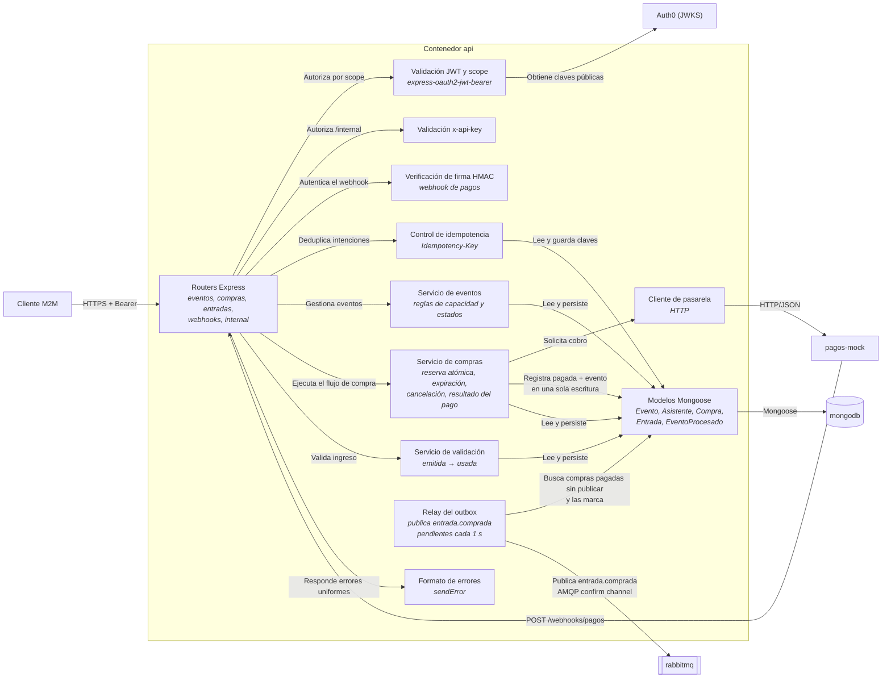
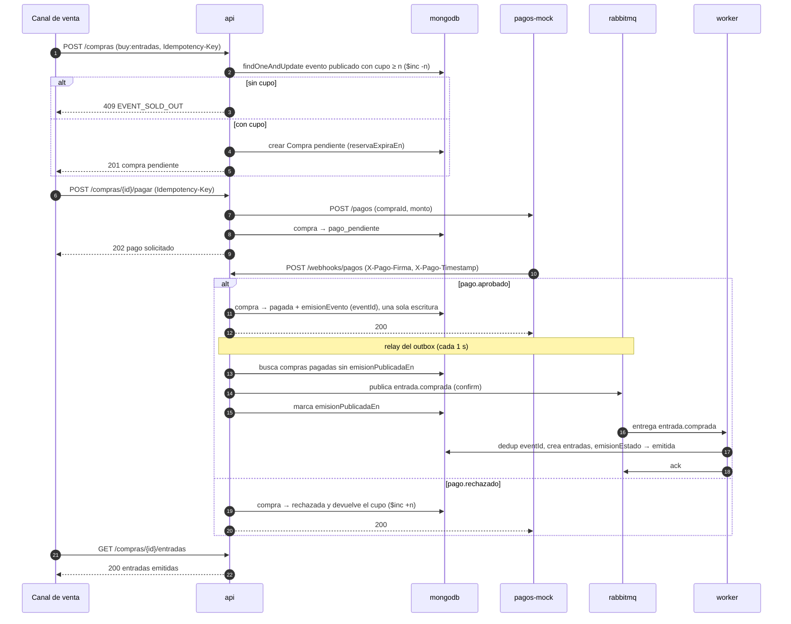

# C4 — Nivel 3: Componentes del contenedor `api`

**Alcance:** los componentes internos del contenedor `api` y sus relaciones. No baja a funciones ni clases. El worker se documenta en [docs/eventos](eventos/README.md).

## Componentes y ubicación en el código

| Componente | Archivo | Estado |
|---|---|---|
| Routers Express | `src/routes/{eventos,compras,entradas,webhooks,internal}.js` | Entrega 2 (hoy, `src/lib/contrato.js` responde 501 en cada operación del contrato) |
| Validación JWT y scope | [`src/middleware/auth0.js`](../src/middleware/auth0.js) | Implementado (`validateAccessToken`, `requireScope`) |
| Validación x-api-key | [`src/middleware/apiKey.js`](../src/middleware/apiKey.js) | Implementado |
| Verificación de firma HMAC | `src/middleware/webhookFirma.js` | Entrega 2 |
| Control de idempotencia | `src/lib/idempotency.js` | Entrega 2 |
| Servicios de eventos, compras y validación | `src/services/*.js` | Entrega 2 |
| Cliente de pasarela | `src/lib/pagos.js` | Entrega 2 |
| Modelos Mongoose | [`src/models/`](../src/models) | Implementado |
| Relay del outbox | [`src/lib/outbox.js`](../src/lib/outbox.js) + [`src/lib/rabbit.js`](../src/lib/rabbit.js) | Implementado (ADR 0009) |
| Formato de errores | [`src/lib/errors.js`](../src/lib/errors.js) | Implementado |

## Secuencia del flujo multi-paso

