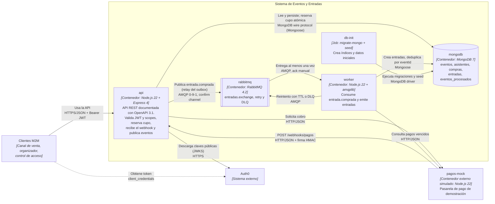

# C4 — Nivel 2: Contenedores del sistema de Eventos y Entradas

**Alcance:** las unidades desplegables dentro del sistema, su tecnología y cómo se comunican. Cada contenedor corresponde 1:1 a un servicio de [`docker-compose.yml`](../docker-compose.yml) con el mismo nombre.

## Responsabilidades

| Contenedor | Tecnología | Responsabilidad | Puertos (host) |
|---|---|---|---|
| `api` | Node.js 22, Express 4, Mongoose 8, express-oauth2-jwt-bearer, amqplib | Expone el contrato [`openapi.json`](openapi.json) y la documentación en `/api-docs`. Valida JWT (firma, issuer, audience, expiración) y scopes, y `x-api-key` en `/internal`. Aplica `Idempotency-Key`, reserva cupo de forma atómica, verifica la firma HMAC del webhook y publica `entrada.comprada` con el relay del outbox | 3000 |
| `worker` | Node.js 22, amqplib, Mongoose 8 | Declara la topología (igual que `api`, de forma idempotente). Consume `emision.entrada-comprada`, emite las entradas de forma idempotente y gestiona reintentos y DLQ. Además ejecuta el barrido periódico: vencimientos, conciliación de pagos con la pasarela, reconciliación de cupo y cierre de eventos ([ADR 0010](adr/adr-0010-ciclo-de-vida-compra-pago-conciliacion.md)) | — |
| `mongodb` | MongoDB 7 | Persistencia de documentos. Garantiza unicidad con índices (ver [modelo de datos](modelo-datos.md)) | 27017 |
| `rabbitmq` | RabbitMQ 4.2 + management | Desacopla el cobro confirmado de la emisión. Ofrece retry con TTL y DLQ | 5672, 15672 |
| `db-init` | Misma imagen que `api` | Job de una sola ejecución: `npm run migrate && npm run seed`. `api` arranca recién cuando termina bien | — |
| `pagos-mock` | Node.js 22 (sin dependencias) | Simula la pasarela externa: recibe el cobro y notifica el resultado por webhook firmado | 4000 |

## Decisiones relacionadas

- Estilo REST y no gRPC para la API pública: [ADR 0001](adr/adr-0001-estilo-api-rest.md), [ADR 0002](adr/adr-0002-rest-vs-grpc.md)
- MongoDB, migraciones y seed: [ADR 0003](adr/adr-0003-mongodb-migraciones-seed.md)
- Seguridad: [ADR 0004](adr/adr-0004-seguridad-auth0-scopes.md)
- RabbitMQ: [ADR 0005](adr/adr-0005-broker-rabbitmq.md)
- Webhook de pago: [ADR 0006](adr/adr-0006-webhook-pago-hmac.md)
- Outbox: [ADR 0009](adr/adr-0009-outbox-entrada-comprada.md)
- Ciclo de vida de la compra, conciliación de pagos y reconciliación de cupo: [ADR 0010](adr/adr-0010-ciclo-de-vida-compra-pago-conciliacion.md)

**Evolución (Entrega 2):** se suman `prometheus` y `grafana` para el dashboard de p95, throughput y error rate ([ADR 0008](adr/adr-0008-observabilidad-correlation-id.md)).
