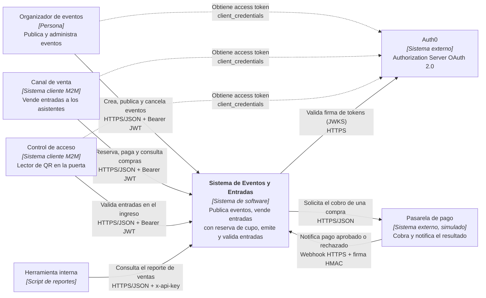

# C4 — Nivel 1: Contexto del sistema de Eventos y Entradas

**Alcance:** el sistema como caja negra, las personas o sistemas que lo usan y las dependencias externas. No muestra detalles internos (ver [Container](c4-container.md)).

**Leyenda:** rectángulo = persona o sistema (el sistema propio es el que está en **negrita**; los demás son clientes o sistemas externos) · flecha continua = el origen inicia una llamada hacia el destino · **flecha punteada = obtención del token**, previa al uso de la API.

## Elementos

| Elemento | Tipo | Responsabilidad | Scopes / credencial |
|---|---|---|---|
| Organizador de eventos | Persona (vía cliente M2M) | Alta, modificación, publicación y baja de eventos | `read:eventos`, `write:eventos`, `admin:eventos` |
| Canal de venta | Sistema cliente | Ejecuta el flujo de compra en nombre del asistente | `read:eventos`, `buy:entradas` |
| Control de acceso | Sistema cliente | Consulta y valida entradas en la puerta | `validate:entradas` |
| Herramienta interna | Script | Lee métricas de ventas | `x-api-key` (comparación, no OAuth) |
| Sistema de Eventos y Entradas | Sistema propio | Ver [Container](c4-container.md) | — |
| Auth0 | Externo | Emite tokens JWT RS256 con audience `https://iaew-eventos-api` | — |
| Pasarela de pago | Externo (simulado por `pagos-mock`) | Cobra y avisa el resultado por webhook firmado | Secreto compartido `WEBHOOK_SECRET` |

En la demo, cada cliente M2M es una aplicación Machine to Machine de Auth0 con los scopes de su rol, usada desde Postman o curl.
