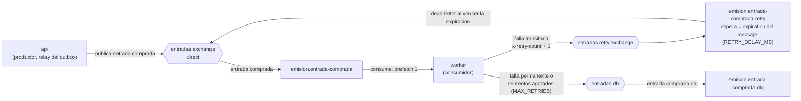

# Catálogo de mensajes asincrónicos

Este documento lista los mensajes que el sistema intercambia fuera del ciclo request/response: el evento de dominio que viaja por RabbitMQ y la notificación de pago que llega por webhook.

## `entrada.comprada` v1 (RabbitMQ)

| Aspecto | Valor |
|---|---|
| Contrato | [`entrada-comprada.schema.json`](entrada-comprada.schema.json) (JSON Schema 2020-12, `additionalProperties: false`) |
| Ejemplo | [`ejemplos/entrada-comprada.ejemplo.json`](ejemplos/entrada-comprada.ejemplo.json) |
| Productor | `api`: el webhook `pago.aprobado` registra el evento en `compras.emisionEvento` (outbox) y el relay lo publica en menos de `OUTBOX_INTERVALO_MS` ([ADR 0009](../adr/adr-0009-outbox-entrada-comprada.md)) |
| Consumidor | `worker`: emite una `Entrada` por unidad comprada y marca `compra.emisionEstado = emitida` |
| Exchange | `entradas.exchange` (direct, durable) |
| Routing key | `entrada.comprada` |
| Cola | `emision.entrada-comprada` (durable) |
| Garantía | Al menos una vez (*at least once*): confirm channel en el productor, `persistent: true`, ack manual del consumidor después de persistir y `prefetch(1)` |
| Identidad | `eventId` (UUID) = `messageId` de AMQP. Se persiste en `compras.emisionEvento`, así que si el relay publica dos veces, lo hace con **el mismo** `eventId` |
| Deduplicación | `eventos_procesados.eventId` único, más el índice único `entradas(compraId, numero)` como segunda barrera |
| Trazabilidad | `correlationId` copia el `X-Correlation-Id` de la solicitud que originó el pago (ADR 0008) |
| Compatibilidad | Solo cambios aditivos dentro de v1. Un cambio incompatible crea `version: 2` y una cola nueva |

Validar el ejemplo contra el esquema:

```bash
npx --yes -p ajv-cli@5 -p ajv-formats ajv validate --spec=draft2020 -c ajv-formats \
  -s docs/eventos/entrada-comprada.schema.json \
  -d docs/eventos/ejemplos/entrada-comprada.ejemplo.json
```

(`npm test` también lo valida.)

### Topología de reintentos



| Elemento | Nombre | Argumentos |
|---|---|---|
| Exchange principal | `entradas.exchange` | direct, durable |
| Exchange de reintento | `entradas.retry.exchange` | direct, durable |
| Cola de reintento | `emision.entrada-comprada.retry` | `x-dead-letter-exchange = entradas.exchange`, `x-dead-letter-routing-key = entrada.comprada`. **Sin** `x-message-ttl`: la espera la fija cada mensaje con `expiration = RETRY_DELAY_MS` |
| Dead letter exchange | `entradas.dlx` | direct, durable |
| Dead letter queue | `emision.entrada-comprada.dlq` | binding `entrada.comprada.dlq` |

Headers que agrega el worker: `x-retry-count`, `x-last-error` y `x-dlq-reason`.

**Quién declara la topología.** `api` y `worker` ejecutan la misma `declararTopologia` de [`src/lib/rabbit.js`](../../src/lib/rabbit.js), de forma idempotente y sin argumentos que dependan del entorno. Así un mensaje publicado por la `api` nunca se pierde por una cola todavía inexistente (RabbitMQ descarta sin avisar lo que no tiene cola de destino), y un `RETRY_DELAY_MS` distinto entre servicios no provoca `PRECONDITION_FAILED`: el retraso viaja en cada mensaje (`expiration`) y no en los argumentos de la cola. Con una espera constante, la cola de retry mantiene el orden y no hay bloqueo en la cabeza. En la Entrega 1 el worker ya la crea al iniciar y se puede ver en la consola de RabbitMQ (http://localhost:15672).

## Notificación de pago (webhook HTTP)

| Aspecto | Valor |
|---|---|
| Contrato | `POST /webhooks/pagos`, schema `NotificacionPago` en [`docs/openapi.json`](../openapi.json) |
| Emisor | `pagos-mock` (pasarela de pago simulada) |
| Receptor | `api` |
| Tipos | `pago.aprobado`, `pago.rechazado` |
| Autenticación | `X-Pago-Firma: sha256=<hex>` = HMAC-SHA256(`WEBHOOK_SECRET`, `<X-Pago-Timestamp>.<cuerpo crudo>`), con tolerancia de ±`WEBHOOK_TOLERANCIA_SEGUNDOS` (ADR 0006) |
| Reintentos | La pasarela reintenta ante 5xx o timeout. La API es idempotente por la máquina de estados de la compra, y una caída de RabbitMQ no afecta al webhook porque la publicación la hace el outbox |
