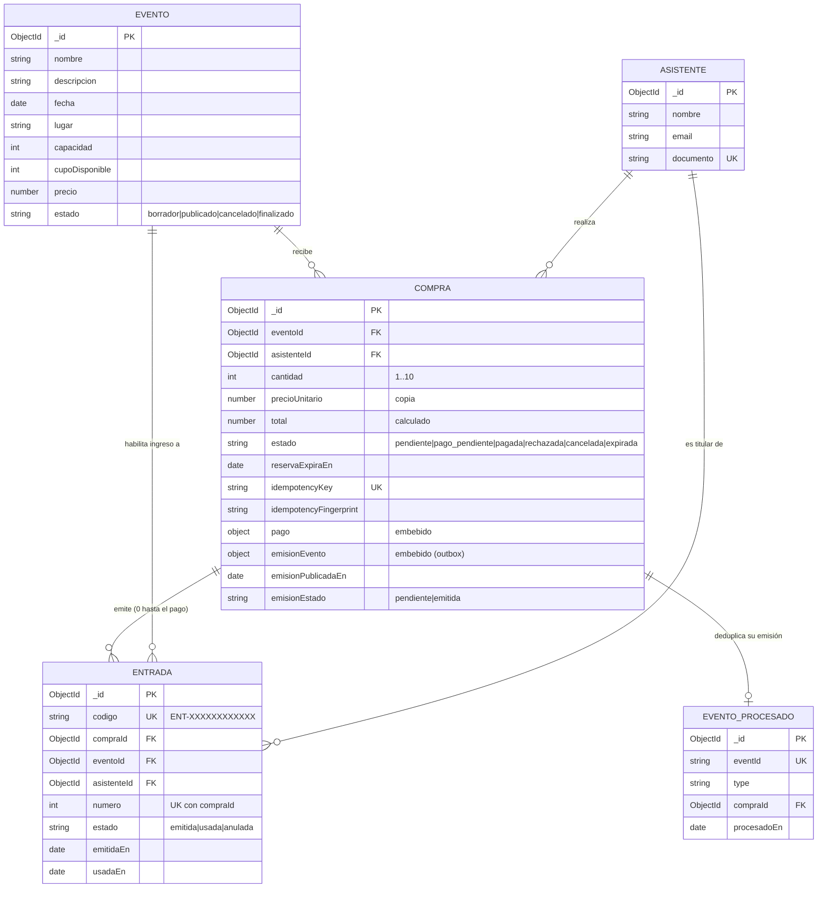
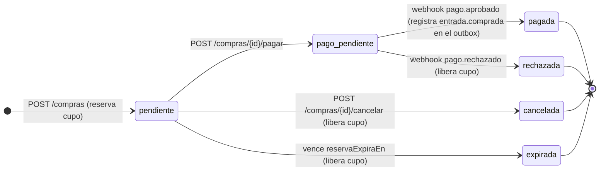
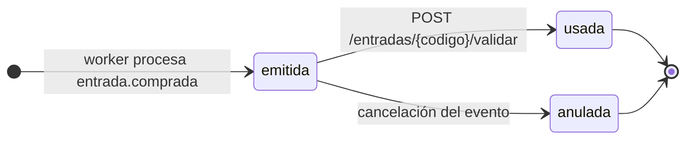

# Modelo de datos

**Motor:** MongoDB 7, base de datos `iaew_eventos`. **ODM:** Mongoose 8. **Esquemas:** [`src/models/`](../src/models). **Índices:** [`migrations/`](../migrations). Justificación en el [ADR 0003](adr/adr-0003-mongodb-migraciones-seed.md).

## Diagrama

Todas las colecciones tienen `createdAt` y `updatedAt` (`timestamps: true`).

## Colecciones

### `eventos`
| Campo | Tipo | Reglas |
|---|---|---|
| `nombre` | string | requerido, ≤ 120 |
| `descripcion` | string | ≤ 2000 |
| `fecha` | Date | requerido |
| `lugar` | string | requerido, ≤ 200 |
| `capacidad` | int | requerido, ≥ 1 |
| `cupoDisponible` | int | ≥ 0. Al crear vale `capacidad`. Solo lo modifican la reserva (`$inc -n`), la liberación (`$inc +n`) y el ajuste de capacidad |
| `precio` | number | ≥ 0 |
| `estado` | enum | `borrador` (por defecto), `publicado`, `cancelado`, `finalizado` |

**Invariante:** `0 ≤ cupoDisponible ≤ capacidad` y `capacidad − cupoDisponible` = cantidad en compras `pendiente`, `pago_pendiente` y `pagada`.

### `asistentes`
Persona titular de las entradas. Se crea o se reutiliza por `documento` (único) al reservar.

### `compras`
| Campo | Tipo | Reglas |
|---|---|---|
| `eventoId`, `asistenteId` | ObjectId | referencias requeridas |
| `cantidad` | int | 1..10 |
| `precioUnitario` | number | copia del precio del evento al reservar: un cambio de precio posterior no altera compras existentes |
| `total` | number | `cantidad × precioUnitario`, lo calcula el servidor |
| `estado` | enum | ver máquina de estados |
| `reservaExpiraEn` | Date | creación + `RESERVA_TTL_MINUTOS` |
| `idempotencyKey` / `idempotencyFingerprint` | string | clave del `POST /compras` (única) y hash SHA-256 del cuerpo, para detectar reutilización con otros datos |
| `pago` | subdocumento | `estado` (`pendiente`/`aprobado`/`rechazado`), `referenciaExterna`, `idempotencyKey` del `POST /pagar`, `motivoRechazo`, `solicitadoEn`, `procesadoEn` |
| `emisionEvento` | subdocumento | outbox: sobre completo de `entrada.comprada` (con `eventId`), escrito junto con el cambio a `pagada` |
| `emisionPublicadaEn` | Date | lo marca el relay cuando RabbitMQ confirma la publicación. Vacío = pendiente de publicar ([ADR 0009](adr/adr-0009-outbox-entrada-comprada.md)) |
| `emisionEstado`, `emitidaEn` | enum, Date | estado del efecto asincrónico, separado del estado de negocio |

### `entradas`
Una por unidad comprada. `codigo` es el contenido del QR: `ENT-` + 12 caracteres aleatorios `[A-Z0-9]` generados con `crypto.randomInt`. Es único y no se puede adivinar.

### `eventos_procesados`
Registro de `eventId` ya consumidos por el worker (deduplicación *at least once*).

## Referencias vs. embebidos

| Relación | Decisión | Motivo |
|---|---|---|
| Compra → Evento / Asistente | Referencia + copia de `precioUnitario` | El evento cambia independientemente (cupo, precio). La compra conserva el precio pactado |
| Compra → Pago | Embebido | El pago no existe fuera de su compra y se actualiza junto con el estado. Un único documento permite una actualización atómica |
| Compra → `emisionEvento` | Embebido (outbox) | Una sola escritura atómica registra el cambio a `pagada` y el evento pendiente, sin transacciones multi-documento |
| Entrada → Compra | Colección aparte con referencia | Se consulta y se actualiza sola en el control de acceso, por `codigo`, con alta concurrencia en la puerta |

## Máquinas de estado

Cada transición es un `findOneAndUpdate` condicionado al estado de origen (`{ _id, estado: 'pendiente' }`). Si dos solicitudes compiten, solo una gana y la otra recibe 409. Ver el [ADR 0007](adr/adr-0007-reserva-cupo-idempotencia.md).

## Índices

| Colección | Índice | Tipo | Para qué |
|---|---|---|---|
| `eventos` | `{ estado, fecha }` | simple | listado de eventos publicados por fecha |
| `asistentes` | `{ documento }` | único | reutilizar asistente |
| `compras` | `{ idempotencyKey }` | único | compra duplicada |
| `compras` | `{ pago.idempotencyKey }` | único, sparse | pago duplicado |
| `compras` | `{ pago.referenciaExterna }` | único, sparse | correlacionar el webhook |
| `compras` | `{ eventoId, estado }` | simple | reporte de ventas, borrado de evento |
| `compras` | `{ estado, reservaExpiraEn }` | simple | barrido de reservas vencidas |
| `compras` | `{ estado, emisionPublicadaEn }` | simple | relay del outbox (migración `20261003150000-indice-outbox.js`) |
| `entradas` | `{ codigo }` | único | validación en la puerta |
| `entradas` | `{ compraId, numero }` | único | emisión idempotente |
| `entradas` | `{ eventoId, estado }` | simple | anular entradas al cancelar un evento |
| `eventos_procesados` | `{ eventId }` | único | deduplicación del consumidor |

## Estrategia de migraciones y seed

1. **Migraciones versionadas con [migrate-mongo](https://github.com/seppevs/migrate-mongo).** Están en `migrations/AAAAMMDDhhmmss-descripcion.js`, cada una con `up` y `down`. El historial queda en la colección `migraciones` y un lock (`migraciones_lock`) evita ejecuciones simultáneas. Comandos: `npm run migrate`, `npm run migrate:status` y `npm run migrate:down`.
2. **Los índices son responsabilidad de las migraciones.** Mongoose se conecta con `autoIndex: false`, así crear índices no depende de que arranque la app, y un índice único sobre datos existentes falla en la migración (visible y reversible) en vez de fallar en silencio en runtime. Los esquemas de `src/models` declaran los mismos índices como documentación. La migración inicial es [`20261003120000-indices-iniciales.js`](../migrations/20261003120000-indices-iniciales.js).
3. **Cambios de forma de documentos:** se aplican con migraciones aditivas (agregar el campo con valor por defecto y backfill en `up`). Mientras convivan versiones, el código tolera documentos viejos.
4. **Seed idempotente** ([`scripts/seed.js`](../scripts/seed.js), `npm run seed`). Usa `_id` fijos y `$setOnInsert`, así que correrlo N veces deja el mismo resultado y no repone el cupo ya vendido. Carga 3 eventos de demostración:
   - `…0001`: publicado, 500 lugares (flujo feliz).
   - `…0002`: publicado, 2 lugares (para provocar `EVENT_SOLD_OUT`).
   - `…0003`: borrador (para provocar `EVENT_NOT_PUBLISHED`).
5. **En Docker Compose** el job `db-init` corre `npm run migrate && npm run seed` antes de que arranque `api`. Para volver a cero: `docker compose down -v`.
